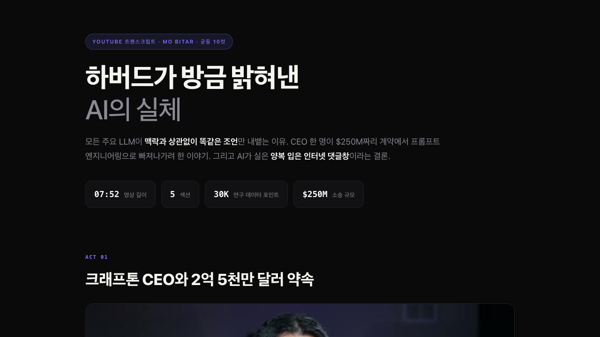

<p align="center">
  <a href="README.md">한국어</a> | <b>English</b>
</p>

<h1 align="center">Research-Skills</h1>

<p align="center">
  <b>One line in Claude Code for paper writing, figures, document automation, and AI text humanization</b>
</p>

<p align="center">
  
  
  
  
  <a href="https://schoung.com"></a>
</p>

<p align="center">
  <a href="#-quick-start">Quick Start</a> &middot;
  <a href="#-skills">Skills</a> &middot;
  <a href="#-benchmark">Benchmark</a> &middot;
  <a href="#-dependencies">Dependencies</a> &middot;
  <a href="#-license">License</a>
</p>

---

## Quick Start

In Claude Code, just say:

```
Clone https://github.com/s-choung/Research-Skills.git and install the skills
```

That's it.

---

## Skills

### Humanizer

- **[humanizer_kor](skills/humanizer_kor)** -- Remove mechanical AI signals from Korean text and make it read like a human wrote it.
- **[humanizer_eng](skills/humanizer_eng)** -- Remove mechanical AI signals from English text and make it read like a human wrote it.

### Paper Team

- **[paper](commands/paper.md)** -- Umbrella command that routes to the full paper writing subagent team.
- **[paper-ref](commands/paper-ref.md)** -- Hunt candidate references for a given claim or topic.
- **[paper-draft](commands/paper-draft.md)** -- Draft IMRAD sections in the author's voice.
- **[paper-critic](commands/paper-critic.md)** -- Scientifically critique a paragraph or section for rigor.
- **[paper-humanize](commands/paper-humanize.md)** -- Strip AI-isms from manuscript text.

### Media

- **[youtube](skills/youtube)** -- Extract transcript + metadata from a YouTube URL as markdown.
- **[youtube2mp4](skills/youtube2mp4)** -- Download YouTube videos as mp4.
- **[transcript2html](skills/transcript2html)** -- Render YouTube transcript markdown as a Korean dark-mode HTML reading view.

### Document

- **[docx-scientific-formatting](skills/docx-scientific-formatting)** -- Auto-fix chemical formula subscripts, italics, and superscripts in scientific .docx files.
- **[html-minimal](skills/html-minimal)** -- Generate self-contained HTML reports with no external JS frameworks.
- **[design2html](skills/design2html)** -- Read a design spec MD and generate a single-file HTML showcase page.
- **[meetingnote-paperwork](skills/meetingnote-paperwork)** -- Draft Korean research project meeting notes in a fixed paperwork template.

### Visualization

- **[matplotlib-scientific](skills/matplotlib-scientific)** -- Create publication-quality matplotlib figures with rcParams, colormap, and legend/axis formatting.
- **[blender-atom-render](skills/blender-atom-render)** -- Render structure files (XYZ, CIF, POSCAR) as Blender sphere models with per-system legends.
- **[slide-audit](skills/slide-audit)** -- Detect text overlap, clipping, and overflow in HTML slide decks via Playwright + visual review.

### Scientific Computing

- **[ase](skills/ase)** -- ASE (Atomic Simulation Environment) code generation skill. Includes 9-LLM benchmark.

### Document (cont.)

- **[pptx-too-heavy](skills/pptx-too-heavy)** -- Find heavy images in PPTX files and generate a visual HTML size report.

### Utility

- **[smart-compact](skills/smart-compact)** -- Save session state before /clear. The next session picks up automatically.

---

## Benchmark

### humanize-writing

Benchmark on 100 AI-generated Korean paragraphs across 20 genres.

<p align="center">
  
</p>

| Metric | Original (AI) | Humanized |
| :---: | :---: | :---: |
| AI-Tell Score (lower = better) | 54.9 | **1.0** (-98.1%) |
| Naturalness (1-10) | 2.9 | **9.2** |
| Fidelity (1-10) | 10.0 | 8.8 |
| Change Rate | 0% | 27.9% |

> Interactive dashboard: [`skills/humanizer_kor/benchmark/benchmark_report.html`](https://s-choung.github.io/Research-Skills/skills/humanizer_kor/benchmark/benchmark_report.html)

### ASE Skill

50-task code generation benchmark with ASE skill injected into 9 LLMs. Pass rate only.

<p align="center">
  
</p>

> Interactive dashboard: [`skills/ase/benchmark/benchmark_report_v6.html`](https://s-choung.github.io/Research-Skills/skills/ase/benchmark/benchmark_report_v6.html)

### transcript2html

YouTube transcript rendered as a dark-mode Korean reading view.

<p align="center">
  
</p>

---

## Dependencies

| Skill | Requirement |
| :---: | :---: |
| `slide-audit` | `cd skills/slide-audit && npm install && npx playwright install chromium` |
| `youtube`, `youtube2mp4` | `brew install yt-dlp ffmpeg` |
| `blender-atom-render` | `brew install --cask blender` |
| `docx-scientific-formatting` | `pip install python-docx lxml` |
| `design2html` | Built-in specs included. `--full` mode needs [impeccable](https://github.com/pbakaus/impeccable) |

---

## License

Seokhyun Choung. Free to use and modify. Contributions welcome.
