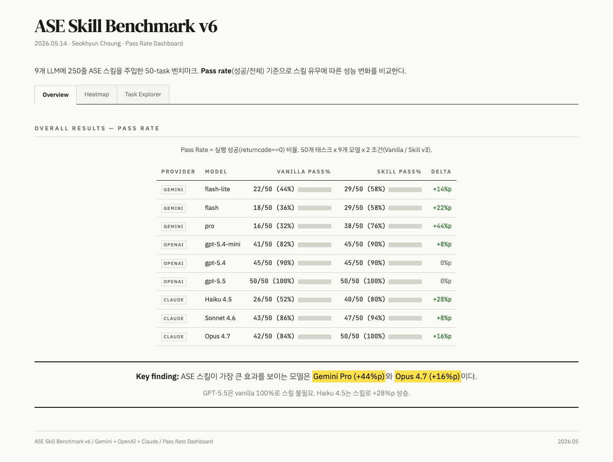

<p align="center">
  <b>한국어</b> | <a href="README.en.md">English</a>
</p>

<h1 align="center">Research-Skills</h1>

<p align="center">
  Claude Code / Codex에 한 줄이면 논문 작성, 피규어, 문서 자동화, AI 텍스트 다듬기까지
</p>

<p align="center">
  <a href="https://s-choung.github.io/Research-Skills/"><b>Dashboard</b></a> &middot;
  <a href="#skills">Skills</a> &middot;
  <a href="#benchmark">Benchmark</a>
</p>

---

## Quick Start

```
https://github.com/s-choung/Research-Skills.git 클론하고 스킬 설치해줘
```

## Skills

| Category | Skill | Description |
|:--|:--|:--|
| **Writing** | [humanizer_kor](skills/humanizer_kor) | AI 한국어 글을 사람이 쓴 것처럼 다듬기 |
| | [humanizer_eng](skills/humanizer_eng) | AI 영어 글을 사람이 쓴 것처럼 다듬기 |
| | [paper](commands/paper.md) | 논문 작성 전 과정 umbrella (ref, draft, critic, humanize) |
| **Visualization** | [matplotlib-scientific](skills/matplotlib-scientific) | 출판용 matplotlib figure 생성 |
| | [blender-atom-render](skills/blender-atom-render) | 구조 파일을 Blender 원자 렌더링 |
| | [slide-audit](skills/slide-audit) | HTML 슬라이드 레이아웃 버그 탐지 |
| | [misodi-slides](skills/misodi-slides) | 미소디 과제 스타일 슬라이드 생성 (HTML+PPTX 동일 출력, fade 애니메이션) |
| **Document** | [design2html](skills/design2html) | 디자인 스펙을 single-file HTML 쇼케이스로 |
| | [docx-scientific-formatting](skills/docx-scientific-formatting) | .docx 화학식 아래첨자, 위첨자 자동 교정 |
| | [html-minimal](skills/html-minimal) | 외부 의존성 없는 self-contained HTML 리포트 |
| | [meetingnote-paperwork](skills/meetingnote-paperwork) | 연구과제 회의록 템플릿 |
| **Media** | [youtube](skills/youtube) | YouTube transcript markdown 추출 |
| | [youtube2mp4](skills/youtube2mp4) | YouTube mp4 다운로드 |
| | [transcript2html](skills/transcript2html) | transcript를 한국어 다크모드 HTML로 |
| **Computing** | [ase](skills/ase) | ASE 코드 생성 (9-LLM 벤치마크 포함) |
| **Utility** | [pptx-too-heavy](skills/pptx-too-heavy) | PPTX 무거운 이미지 분석 리포트 |
| | [smart-compact](skills/smart-compact) | 세션 상태 저장, 다음 세션 자동 복구 |

## Benchmark

<p align="center">
  
</p>

| Skill | Key Result | Dashboard |
|:--|:--|:--|
| **humanizer_kor** | AI-Tell 54.9 &rarr; **1.0** (-98%) &middot; Naturalness 2.9 &rarr; **9.2** | [**Dashboard**](https://s-choung.github.io/Research-Skills/skills/humanizer_kor/benchmark/benchmark_report.html) |
| **humanizer_eng** | AI-Tell 89.8 &rarr; **3.6** (-96%) &middot; Naturalness 1.2 &rarr; **9.4** | [**Dashboard**](https://s-choung.github.io/Research-Skills/skills/humanizer_eng/benchmark/benchmark_report.html) |
| **ase** | 9 LLM &times; 50 tasks 코드 생성 벤치마크 | [**Dashboard**](https://s-choung.github.io/Research-Skills/skills/ase/benchmark/benchmark_report_v7.html) |
| **matplotlib-scientific** | Before/After 3종 (scatter, bar, line) | [**Dashboard**](https://s-choung.github.io/Research-Skills/skills/matplotlib-scientific/benchmark/benchmark_report.html) |
| **design2html** | 동일 콘텐츠 &times; 6 디자인 시스템 비교 | [**Dashboard**](https://s-choung.github.io/Research-Skills/skills/design2html/benchmark/benchmark_report.html) |
| **blender-atom-render** | POSCAR/CIF Blender 렌더 갤러리 | [**Dashboard**](https://s-choung.github.io/Research-Skills/skills/blender-atom-render/benchmark/benchmark_report.html) |
| **transcript2html** | raw 자막을 한국어 다크모드 HTML로 | [**Dashboard**](https://s-choung.github.io/Research-Skills/skills/transcript2html/benchmark/benchmark_report.html) |

## Dependencies

| Skill | Requirement |
|:--|:--|
| `slide-audit` | `cd skills/slide-audit && npm install && npx playwright install chromium` |
| `youtube`, `youtube2mp4` | `brew install yt-dlp ffmpeg` |
| `blender-atom-render` | `brew install --cask blender` |
| `docx-scientific-formatting` | `pip install python-docx lxml` |
| `design2html` | Built-in specs 포함. `--full` 모드는 [impeccable](https://github.com/pbakaus/impeccable) 필요 |

## License

Seokhyun Choung. 자유롭게 쓰시고, contribution 환영합니다.
