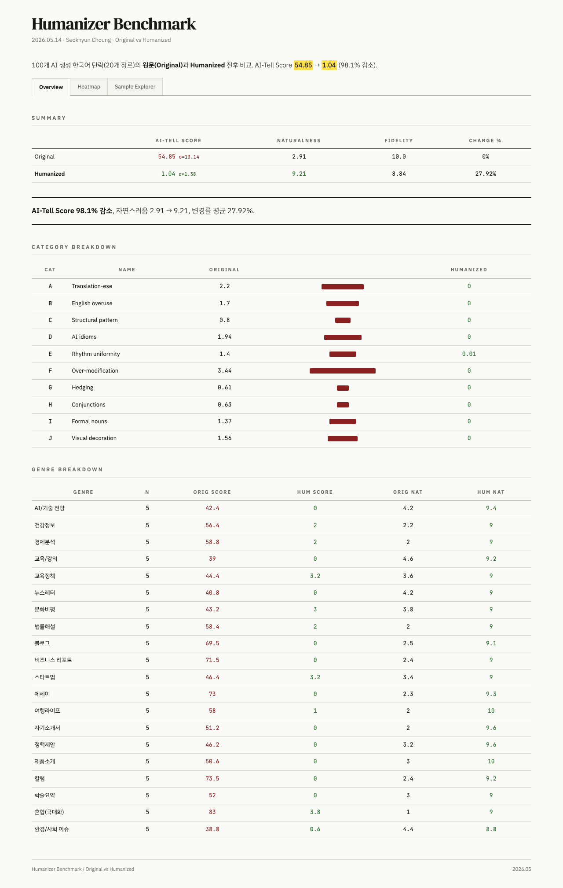

# humanize-writing

Remove mechanical signals from AI-generated text and make it read like a specific person wrote it.

Supports both Korean and English. Triggered by "humanize", "make natural", "remove AI feel", "rewrite like a person wrote it".

## Three Rules

| Priority | Rule |
|---|---|
| 1 | **Don't fabricate** — never invent facts, quotes, sources, personal experience, or numbers not in the original |
| 2 | **Remove mechanical signals** — cut banned vocabulary, fix uniform rhythm, break formulaic structure |
| 3 | **Restore specificity** — surface real claims buried under abstraction |

## Usage

```
Humanize this text

<paste AI-generated text>
```

File paths work too:
```
Humanize draft.md
```

## Before / After

**Before** (AI original):
> Remote work serves as a transformative force in the modern workplace. It has the ability to enhance employee satisfaction and foster greater work-life balance. Furthermore, organizations that leverage remote work arrangements can navigate the complexities of talent acquisition more effectively.

**After** (humanized):
> Remote work changed how companies hire and how employees structure their days. People who work from home skip the commute — that's roughly an hour a day in most metro areas — and generally report higher job satisfaction. Companies get to recruit from anywhere, which matters most for roles that are hard to fill locally.

## Benchmark (100 AI-generated Korean paragraphs)

<p align="center">
  
</p>

| Metric | Original (AI) | Humanized |
|---|---|---|
| **AI-Tell Score** (0-100, lower = better) | 54.9 | **1.0** |
| **Naturalness** (1-10) | 2.9 | **9.2** |
| **Fidelity** (1-10) | 10.0 | 8.8 |
| **Change Rate** | 0% | 27.9% |

> Full interactive report: [`benchmark/benchmark_report.html`](benchmark/benchmark_report.html)

## How It Works

1. **Identify audience and edit depth** — infer reader from terms used without definition, consequences stated without explanation, and pronoun patterns
2. **Edit** — replace generic openings with specific claims, ensure every sentence has a named actor or falsifiable claim, vary rhythm, engage counter-arguments honestly
3. **Check for over-correction** — if specificity feels performed rather than observed, remove it

## File Structure

```
humanize-writing/
├── SKILL.md                          # Skill definition
├── README.md                         # Korean README
├── README.en.md                      # This file
├── references/
│   ├── korean-patterns.md            # Korean AI pattern catalog
│   ├── examples.md                   # Before/after calibration
│   └── guide.md                      # Deep principles reference
└── benchmark/
    ├── benchmark_report.html         # Interactive benchmark dashboard
    ├── scored_vanilla.json           # 100 original samples scored
    └── scored_new.json               # 100 humanized samples scored
```
